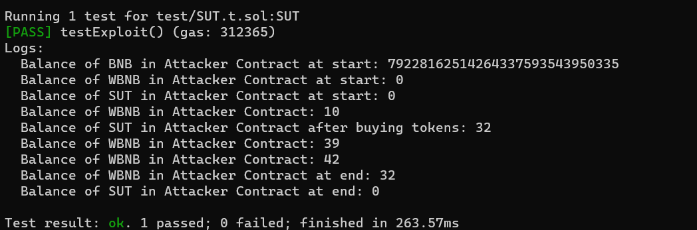

## Welcome to capturethefoundry

_capturethefoundry_ is a platform to practice foundry skills like writing PoCs and debugging. Every module relates to a real life exploit, and a successful completion of the task will mean reproducing an actual hack.

## SUT Token Exploit, Binance Smart Chain

Hey fellow researchers! Earlier today, my boss told me about an exploit that happened and asked me to reproduce the exploit. I had to rush to watch a movie so I created a test file haphazardly without running and tests and sent it to my boss. During the movie, my boss texted me, saying that my test file could not work. Please help me to fix my file, I think there's about **10 issues** to fix.

## Objectives

I believe that the main invocation flow is correct, so please do not change the core functionalities (eg using another flashloan provider, using a different swap function). Look out for issues like typos, missing/wrong parameters, wrong function names etc.

1. Clone this repository locally (Make sure you have foundry installed)
2. Run the following command:

```
    forge build
```
3. Run the following test command. The test should fail.

```
    forge test --match-path test/SUT.t.sol -vv
```

4. Fix the issues in the test suite and re-run the above command. The test should pass once everything has been fixed.

If you have succeeded, you should see this in your console: 



## Hints

Hmmm... I would start with examining at the interface... there are two problems there. Oh, and typos, there's quite a lot of it.  

There's probably nothing wrong with the contract addresses, so I wouldn't advice changing anything there... maybe something around the swapping functionality, or the depositing? Oh, I forgot to mention, I think the exploit uses BNB instead of WBNB... the contract probably needs to accept BNB

Also, pay attention to your command line as it'll tell you about the issues you need to rectify. Fix the issues one at a time and you'll be fine!

## Solution

The solution will be posted on (to be created). You can also DM me on Twitter if you're stuck and I'll guide you through the procecss.

Good luck, researcher!


